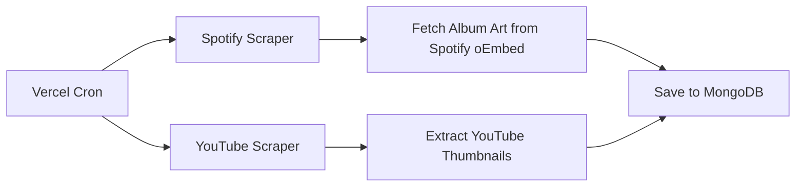
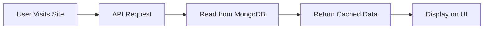

# Automatic Scraping Setup (Every 24 Hours)

## Overview

The trending section now automatically scrapes data from kworb.net **once every 24 hours** using Vercel Cron Jobs. This ensures:

✅ **Fresh data daily** - New rankings and stream counts  
✅ **No API limits** - Thumbnails fetched only during scraping  
✅ **Fast performance** - Data served from MongoDB cache all day  
✅ **Cost efficient** - Only 2 scrape operations per day  

## Cron Schedule

Both scrapers run **daily at 1:30 AM UTC**:

| Cron Job | Schedule | Frequency | Purpose |
|----------|----------|-----------|---------|
| Spotify | `30 1 * * *` | Daily 1:30 AM UTC | Scrape Spotify data + album art |
| YouTube | `35 1 * * *` | Daily 1:35 AM UTC | Scrape YouTube data + thumbnails |

> **Note:** YouTube runs 5 minutes after Spotify to avoid overloading the server.

## How It Works

### 1. Scraping Phase (Once per day)


**Spotify Scraper:**
- Scrapes song data from kworb.net
- Extracts Spotify track IDs
- Fetches album art using Spotify oEmbed API (no auth required)
- Saves everything to `KworbSnapshot` collection

**YouTube Scraper:**
- Scrapes video data from kworb.net
- Extracts YouTube video IDs
- Generates thumbnail URLs (i.ytimg.com/vi/{videoId}/maxresdefault.jpg)
- Saves everything to `YouTubeKworbSnapshot` collection

### 2. Serving Phase (Entire day)


- API reads from MongoDB (latest snapshot)
- Thumbnails already stored in database
- No external API calls needed
- Fast response times

## Configuration

### vercel.json
```json
{
  "crons": [
    { "path": "/api/spotify/kworb/cron", "schedule": "30 1 * * *" },
    { "path": "/api/youtube/kworb/cron", "schedule": "35 1 * * *" }
  ]
}
```

### Environment Variables (Vercel Dashboard)
```env
MONGODB_URI=your_mongodb_connection_string
CRON_SECRET=your_secret_key_for_manual_triggers
```

## Manual Triggering

### Development (localhost)
```bash
# Trigger Spotify scraper
curl -X POST http://localhost:3001/api/spotify/kworb/cron

# Trigger YouTube scraper
curl -X POST http://localhost:3001/api/youtube/kworb/cron
```

### Production (Vercel)
```bash
# With authentication
curl -X POST https://your-domain.vercel.app/api/spotify/kworb/cron \
  -H "Authorization: Bearer YOUR_CRON_SECRET"

curl -X POST https://your-domain.vercel.app/api/youtube/kworb/cron \
  -H "Authorization: Bearer YOUR_CRON_SECRET"
```

### Using Debug Page
Visit: `https://your-domain.vercel.app/test-trending`

Click the "Trigger Cron" buttons to manually run scrapers.

## Data Flow Architecture

```
┌─────────────────────────────────────────────────────────────┐
│                    DAILY SCRAPING (1:30 AM UTC)              │
├─────────────────────────────────────────────────────────────┤
│                                                              │
│  Kworb.net ──────► Spotify Scraper ──────► MongoDB         │
│                    • Parse song data                         │
│                    • Extract track IDs                       │
│                    • Fetch album art (oEmbed API)           │
│                    • Save with thumbnails                    │
│                                                              │
│  Kworb.net ──────► YouTube Scraper ──────► MongoDB         │
│                    • Parse video data                        │
│                    • Extract video IDs                       │
│                    • Generate thumbnail URLs                 │
│                    • Save with thumbnails                    │
│                                                              │
└─────────────────────────────────────────────────────────────┘

┌─────────────────────────────────────────────────────────────┐
│                 ALL DAY SERVING (CACHED DATA)                │
├─────────────────────────────────────────────────────────────┤
│                                                              │
│  User Request ──────► API ──────► MongoDB ──────► Response │
│                       • Read latest snapshot                 │
│                       • Filter by artist                     │
│                       • Sort by daily streams                │
│                       • Return top 6 songs                   │
│                       • Thumbnails included                  │
│                                                              │
└─────────────────────────────────────────────────────────────┘
```

## Thumbnails Strategy

### Spotify Album Art
- **Source:** Spotify oEmbed API
- **URL Format:** `https://open.spotify.com/oembed?url=spotify:track:{trackId}`
- **Fetched:** During daily scraping only
- **Stored:** In MongoDB as `albumArt` field
- **No Auth Required:** Public oEmbed endpoint
- **Size:** 300x300px (standard Spotify thumbnail)

### YouTube Thumbnails
- **Source:** YouTube CDN
- **URL Format:** `https://i.ytimg.com/vi/{videoId}/maxresdefault.jpg`
- **Fetched:** Generated during scraping (URL only, not downloaded)
- **Stored:** In MongoDB as `thumbnail` field
- **No API Call:** Direct CDN link
- **Size:** 1280x720px (max resolution)

### Why This Approach?

✅ **No API Limits** - Only fetch once per day  
✅ **Fast Loading** - Thumbnails served from CDN  
✅ **No Rate Limiting** - Spotify oEmbed is generous  
✅ **Reliable** - YouTube thumbnails are permanent  
✅ **Cost-Free** - No API keys required  

## MongoDB Collections

### KworbSnapshot (Spotify)
```json
{
  "dateKey": "2025-10-23",
  "songsByArtist": [
    {
      "artist": "BTS",
      "songs": [
        {
          "name": "Dynamite",
          "totalStreams": 3500000000,
          "dailyGain": 250000,
          "url": "https://kworb.net/spotify/track/...",
          "albumArt": "https://i.scdn.co/image/..." // ✅ NEW
        }
      ]
    }
  ],
  "createdAt": "2025-10-23T01:30:00.000Z",
  "updatedAt": "2025-10-23T01:30:00.000Z"
}
```

### YouTubeKworbSnapshot
```json
{
  "dateKey": "2025-10-23",
  "artistGroups": [
    {
      "artist": "BTS",
      "songs": [
        {
          "rank": 1,
          "title": "Dynamite Official MV",
          "views": 2000000000,
          "yesterday": 550000,
          "videoId": "gdZLi9oWNZg",
          "thumbnail": "https://i.ytimg.com/vi/gdZLi9oWNZg/maxresdefault.jpg",
          "url": "https://www.youtube.com/watch?v=gdZLi9oWNZg"
        }
      ]
    }
  ],
  "createdAt": "2025-10-23T01:35:00.000Z",
  "updatedAt": "2025-10-23T01:35:00.000Z"
}
```

## Monitoring

### Check if Cron Ran
```bash
# Development
curl http://localhost:3001/api/spotify/kworb/latest
curl http://localhost:3001/api/youtube/kworb/latest

# Production
curl https://your-domain.vercel.app/api/spotify/kworb/latest
curl https://your-domain.vercel.app/api/youtube/kworb/latest
```

Look for `dateKey` field - should be today's date.

### Vercel Dashboard
1. Go to your project in Vercel
2. Click **Settings** → **Cron Jobs**
3. View execution history and logs

### Debug Page
Visit `/test-trending` to see:
- ✅ Last scrape date
- ✅ Number of songs per artist
- ✅ Quick trigger buttons

## Performance

### Scraping Time
- **Spotify:** ~30-60 seconds (includes album art fetching)
- **YouTube:** ~10-20 seconds (no external API calls)

### API Response Time
- **With Cache:** <100ms (MongoDB query)
- **First Request:** ~200-300ms (cache miss)

### Data Freshness
- **Updated:** Once per day at 1:30 AM UTC
- **Stale:** Up to 24 hours (acceptable for trending data)

## Troubleshooting

### Cron Not Running
1. Check Vercel dashboard → Cron Jobs
2. Verify environment variables are set
3. Check function logs for errors
4. Manually trigger to test: `/test-trending` page

### No Album Art Showing
1. Trigger Spotify cron manually
2. Check MongoDB for `albumArt` field
3. Verify `i.scdn.co` in `next.config.js`
4. Clear browser cache and hard refresh

### Old Data Showing
1. Check `dateKey` in database
2. Trigger cron manually if needed
3. Clear API cache (wait 30 minutes)

### Thumbnails Not Loading
1. Check image domains in `next.config.js`
2. Verify thumbnail URLs in MongoDB
3. Test URL directly in browser
4. Check browser console for CORS errors

## Cost Breakdown

| Item | Frequency | Cost |
|------|-----------|------|
| Vercel Cron | 2 per day | Free (Hobby plan) |
| MongoDB Reads | ~1000 per day | Free (Atlas M0) |
| MongoDB Writes | 2 per day | Free |
| Spotify oEmbed | ~300 per day | Free (no limit) |
| YouTube Thumbnails | 0 (URL only) | Free |
| **Total** | | **$0/month** |

## Best Practices

✅ **Don't modify cron schedule** - Once per day is optimal  
✅ **Don't fetch thumbnails on every request** - Use cached data  
✅ **Monitor MongoDB storage** - Old snapshots can be cleaned up  
✅ **Set up alerts** - Know if crons fail  
✅ **Use dateKey index** - For fast queries  

## Future Improvements

Potential enhancements:
- [ ] Multiple snapshots per day (morning/evening)
- [ ] Webhook notifications when scraping completes
- [ ] Automatic cleanup of old snapshots (>7 days)
- [ ] Regional ranking data
- [ ] Real-time updates via WebSocket (requires different approach)

## Summary

The trending section is now fully automated:
1. ✅ Scrapers run automatically every 24 hours
2. ✅ Album art and thumbnails fetched once per day
3. ✅ All data cached in MongoDB
4. ✅ No API limits or rate limiting issues
5. ✅ Fast, reliable, and cost-free

Your site will have fresh data every morning at 1:30 AM UTC without any manual intervention!
