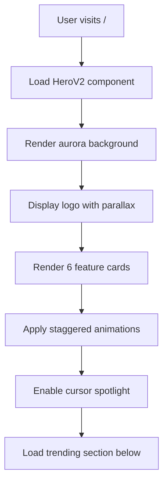
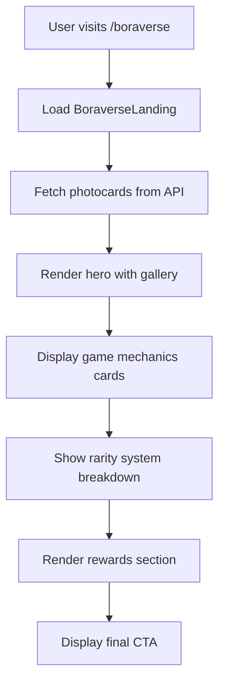

# Landing Pages

## What It Is

Two premium landing pages designed for conversion and engagement:
1. **Homepage (/)** - Main platform landing with feature showcase
2. **Boraverse Landing (/boraverse)** - Dedicated game landing page

## Homepage Landing Page

### Design Features

**Visual Elements:**
- **Aurora Background** - Animated radial gradients for depth
- **Glassmorphism** - Premium glass surfaces with blur effects
- **Cursor Spotlight** - Subtle follow effect for interactivity
- **Parallax Logo** - Logo moves 3px based on cursor position
- **Noise Texture** - Fine grain overlay for richness

**Layout Structure:**
- **Split Layout (Desktop)**: Logo left, 6 feature cards right
- **Responsive**: Stacks on tablet/mobile
- **Feature Cards**: 2x3 grid showcasing all platform features

### Six Feature Cards

1. **BTS + Solo Trends**
   - Icon: TrendingUp
   - Color: Blue/Cyan gradient
   - Links to: /trending
   - Description: Live charts across Spotify and YouTube

2. **AI Playlist**
   - Icon: Sparkles
   - Color: Purple/Pink gradient
   - Links to: /ai-playlist
   - Description: Instant mixes from vibe or activity

3. **Streaming Playlists**
   - Icon: Target
   - Color: Rose/Fuchsia gradient
   - Links to: /create-playlist
   - Description: Goal-driven sets for comeback streaming

4. **Boraverse (Games)**
   - Icon: Trophy
   - Color: Amber/Orange gradient
   - Links to: /boraverse
   - Description: Quizzes, mastery, weekly leaderboards

5. **Streaming Stats**
   - Icon: BarChart3
   - Color: Emerald/Green gradient
   - Links to: /spotify
   - Description: Global performance snapshots

6. **Spotify Analytics**
   - Icon: Music
   - Color: Violet/Purple gradient
   - Links to: /stats
   - Description: Your top artists, habits, insights

### Interactions

**Card Hover Effects:**
- Neon border glow (purple/pink gradient)
- 4px lift with enhanced shadow
- Icon scale and glow
- Staggered fade-up animation (80-120ms delays)

**CTAs:**
- Primary: "Explore Trending" (scroll to trending)
- Secondary: "Create Playlists" (navigate to playlist hub)
- Ghost buttons for other features

**Motion:**
- All animations respect `prefers-reduced-motion`
- Smooth transitions (300-400ms)
- GPU-accelerated transforms

## Boraverse Landing Page

### Design Philosophy

**Professional & Luxurious:**
- Premium dark purple/pink/black gradient
- Glassmorphism throughout
- Real photocard gallery
- Sophisticated animations

**Clear Communication:**
- Immediate game concept understanding
- Detailed mechanics before sign-up
- Visual rarity breakdown
- Multiple reward mechanisms explained

### Page Sections

**1. Hero Section**
- Premium badge with pulsing star icon
- Large gradient title (responsive 5xl → 8xl)
- Clear value proposition
- Dual CTAs (Sign In / Demo)
- Scrollable photocard gallery (12 real cards)
- Rarity badges and hover effects
- Gradient fade edges

**2. Game Mechanics Section**
Six detailed feature cards:
- Quiz Gameplay (10 questions)
- Earning Photocards (performance-based)
- Craft & Upgrade system
- Weekly Leaderboards
- Quest system
- Mastery progression

Each card:
- Custom gradient icon background
- Hover lift animation
- Color-coded by feature type
- Chevron indicator on hover

**3. Rarity System Section**
Four rarity tiers displayed with boosted quiz odds (25+ XP band shown):

| Rarity | Drop Rate | Icon | Color |
|--------|-----------|------|-------|
| Legendary | 25% | 👑 Crown | Amber/Gold |
| Epic | 45% | 💎 Gem | Purple/Fuchsia |
| Rare | 30% | ⭐ Star | Blue/Cyan |
| Common | 0% | 💜 Heart | Slate |

**Performance-Based Drops Callout:**
- Explains XP-based bands and how higher XP raises rare/epic/legendary odds
- Shows boosted odds milestones (e.g., 20+ XP and 25+ XP bands)
- Visual indicator of score impact

**4. Rewards & Progression Section**
Four detailed cards:
- **XP & Level System**: 5-20 XP per question, bonuses
- **Crafting System**: Duplicate conversion, strategic gameplay
- **Quests & Challenges**: Daily tasks, achievements, events
- **Global Leaderboards**: Weekly resets, exclusive rewards

**5. Final CTA Section**
- Social proof badge ("Join thousands of ARMYs")
- Large headline + value prop
- Dual CTAs (wider on mobile)
- Trust indicators (Free, No Download, Mobile, Anywhere)
- Quick stats grid (10 questions, 100+ cards, 4 rarities, ∞ fun)

### Real Photocard Integration

**API Endpoint:** `/api/game/photocards/preview`
- Fetches diverse sample (3 legendary, 4 epic, 5 rare, 6 common)
- Returns Cloudinary URLs
- Graceful error handling
- Public endpoint, no auth required

**Display:**
- Next.js Image component with optimization
- Horizontal scroll with snap points
- Loading state handling
- Rarity badges on cards

## Workflow

### Homepage Load Flow



### Boraverse Landing Load Flow



## API Reference

### GET /api/game/photocards/preview

Get sample photocards for landing page display.

**Authentication**: Not required (public endpoint)

**Response:**
```json
{
  "ok": true,
  "photocards": [
    {
      "id": "card123",
      "member": "Jungkook",
      "era": "Love Yourself",
      "set": "LY: Answer",
      "rarity": "legendary",
      "imageUrl": "https://res.cloudinary.com/armyverse/image/upload/v123/photocards/jk_ly_01.jpg"
    },
    {
      "id": "card456",
      "member": "V",
      "era": "Map of the Soul",
      "set": "MOTS: 7",
      "rarity": "epic",
      "imageUrl": "https://res.cloudinary.com/armyverse/image/upload/v123/photocards/v_mots_02.jpg"
    }
  ]
}
```

## Configuration

### CSS Classes (in globals.css)

**Aurora System:**
```css
.aurora-container       /* Container for aurora layers */
.aurora-glow           /* Base glow element */
.aurora-glow-1/2/3     /* Three animated gradient layers */
@keyframes aurora-drift /* Smooth drifting animation */
```

**Animations:**
```css
@keyframes fadeUp      /* Fade-up entrance */
.animate-fade-up       /* Utility class */
```

**Utilities:**
```css
.bg-noise              /* SVG noise pattern */
.page-gradient         /* Main background gradient */
.container-glass       /* Glass panel style */
```

### Component Files

**Homepage:**
- `components/sections/HeroV2.tsx` - Main hero section
- `components/sections/FeatureShowcase.tsx` - Feature cards grid
- `components/ui/FeatureCard.tsx` - Individual feature card

**Boraverse:**
- `components/boraverse/BoraverseLanding.tsx` - Complete landing page
- `app/api/game/photocards/preview/route.ts` - Photocard API

## Design System

### Color Palette

**Primary Colors:**
- Purple: `#A274FF` / `rgba(162, 116, 255, x)`
- Pink: `#FF9AD5` / `rgba(255, 154, 213, x)`
- Lavender: `#C084FC` / `rgba(192, 132, 252, x)`

**Rarity Colors:**
- Legendary: Amber (#F59E0B) / Gold (#FCD34D)
- Epic: Purple (#A855F7) / Fuchsia (#E879F9)
- Rare: Blue (#3B82F6) / Cyan (#06B6D4)
- Common: Slate (#64748B) / Gray (#94A3B8)

**Glassmorphism:**
- Background: `rgba(255, 255, 255, 0.04-0.08)`
- Border: `rgba(255, 255, 255, 0.1-0.15)`
- Backdrop blur: 12-16px

### Typography

**Homepage:**
- Hero Title: `text-5xl` → `text-7xl` (responsive)
- Feature Title: `text-lg` (18px)
- Body: `text-sm` → `text-base` (14-16px)

**Boraverse:**
- Hero Title: `text-5xl` → `text-8xl` (responsive)
- Section Heading: `text-3xl` → `text-4xl`
- Card Title: `text-xl` (20px)

### Spacing

- 8px base unit
- 12px, 16px, 24px, 32px, 48px scale
- Responsive padding: `px-4` → `px-6` → `px-8`

## Performance

### Image Optimization
- Next.js Image component with proper sizes
- Cloudinary auto-optimization
- Lazy loading below fold
- Responsive srcset generation

### Animation Performance
- GPU-accelerated transforms only
- Staggered delays prevent jank
- Reduced motion support
- Aurora blur optimized for mobile

### Bundle Size
- No new dependencies
- Reuses existing Lucide icons
- Leverages existing CSS system
- Client-side API calls (no SSR overhead)

## Responsive Behavior

### Breakpoints

**Homepage:**
- Mobile (<768px): Single column, 1x6 feature grid
- Tablet (768-1023px): Stacked, 2x3 feature grid
- Desktop (≥1024px): Split layout, logo left + features right

**Boraverse:**
- Mobile (<640px): Single column, horizontal scrolling gallery
- Tablet (640-1023px): 2 column grids, stacked sections
- Desktop (≥1024px): Full layouts, side-by-side content

### Touch Optimization
- Larger tap targets (min 44x44px)
- Horizontal scroll with snap points
- Reduced animations on mobile
- Touch-friendly spacing

## Accessibility

### Keyboard Navigation
- Tab through all interactive elements
- Focus-visible states with neon glow
- Enter/Space for activation
- Semantic HTML structure

### Screen Reader Support
- ARIA labels on cards
- Alt text on all images
- Role attributes for custom components
- Proper heading hierarchy

### Visual Accessibility
- 4.5:1+ contrast ratios
- Scalable text (up to 200%)
- No color-only information
- Focus indicators visible

## Browser Support

✅ Chrome/Edge 90+  
✅ Firefox 88+  
✅ Safari 14+  
✅ Mobile Safari (iOS 14+)  
✅ Chrome Android  

**Fallbacks:**
- Aurora gradients degrade gracefully
- Backdrop blur has solid background fallback
- All animations respect `prefers-reduced-motion`

## Usage Examples

### Using Homepage

```tsx
// app/page.tsx
import HeroV2 from '@/components/sections/HeroV2'
import TrendingSection from '@/components/trending/TrendingSection'

export default function HomePage() {
  return (
    <main>
      <HeroV2 />
      <TrendingSection />
      {/* Other sections */}
    </main>
  )
}
```

### Using Boraverse Landing

```tsx
// app/boraverse/page.tsx
import BoraverseLanding from '@/components/boraverse/BoraverseLanding'

export default function BoraversePage() {
  return <BoraverseLanding />
}
```

### Customizing Feature Cards

```tsx
<FeatureCard
  icon={Sparkles}
  title="AI Playlist"
  description="Instant mixes from your vibe"
  href="/ai-playlist"
  gradient="from-purple-500 to-pink-500"
  delay={200}
/>
```

## Conversion Optimization

### Homepage CTAs
- Primary: "Explore Trending" (scroll action)
- Secondary: "Create Playlists" (navigation)
- Feature cards all clickable (direct to features)

### Boraverse CTAs
- Primary: "Sign In to Play" (authentication)
- Secondary: "Try Demo Mode" (guest play)
- Trust indicators build confidence
- Social proof creates urgency

### A/B Testing Opportunities
- CTA button copy variations
- Feature card ordering
- Hero section layout
- Number of preview cards shown
- Section ordering

## Metrics to Track

### Engagement
- Time on page
- Scroll depth
- Feature card clicks
- Photocard gallery interactions

### Conversion
- Sign-up button clicks
- Demo button clicks
- Bounce rate
- Exit intent

### Technical
- API response time for photocards
- Image load times
- LCP (Largest Contentful Paint)
- CLS (Cumulative Layout Shift)

## Best Practices

### For Designers
- ✅ Maintain consistent gradient usage
- ✅ Use proper image dimensions
- ✅ Test all animations on mobile
- ✅ Ensure readability on all backgrounds

### For Developers
- ✅ Optimize images with Next.js Image
- ✅ Lazy-load below-fold content
- ✅ Implement proper SEO meta tags
- ✅ Test accessibility with screen readers
- ✅ Monitor performance metrics

## Related Documentation

- [Game System](./game-system.md) - Boraverse features
- [Trending Content](./trending-content.md) - Homepage trending section
- [Playlist Generation](./playlist-generation.md) - Playlist features
- [Authentication](./authentication.md) - Sign-up flow
