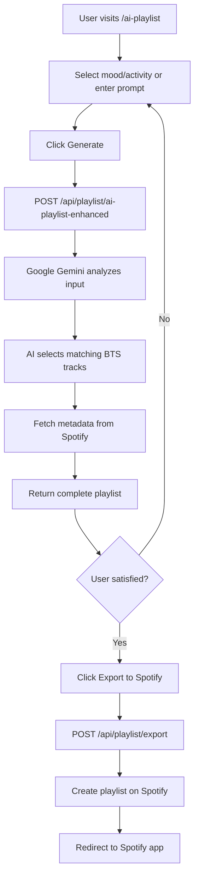
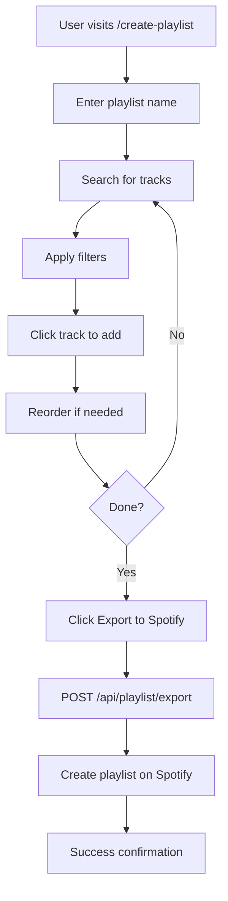

# Playlist Generation

## What It Is

ARMYVERSE offers three powerful ways to create BTS playlists:
1. **AI-Powered Generation** - Google Gemini AI creates playlists based on mood, activity, or preferences
2. **Manual Creation** - Hand-pick tracks with advanced search and filtering
3. **Streaming-Focused** - Goal-driven playlists optimized for comeback streaming campaigns

All playlists can be exported directly to Spotify with one click.

## How It Works

### 1. AI Playlist Generation

Uses Google Gemini AI to analyze user input and generate contextually relevant playlists.

**Process:**
1. User selects mood, activity, or enters custom prompt
2. AI analyzes input and BTS discography
3. Generates playlist with thematic coherence
4. Fetches Spotify track metadata
5. Returns complete playlist with album art

**Supported Inputs:**
- **Moods**: Happy, Sad, Energetic, Chill, Romantic, Empowering, Nostalgic
- **Activities**: Workout, Study, Party, Sleep, Commute, Focus
- **Custom Prompts**: Free-text descriptions (e.g., "upbeat songs for morning motivation")

**Key Features:**
- Intelligent track selection based on audio features
- Era and member distribution
- Tempo and energy matching
- Lyrical theme alignment

### 2. Manual Playlist Creation

Provides full control over playlist composition with advanced tools.

**Features:**
- Real-time search across entire BTS discography
- Filter by:
  - Member (OT7, Jungkook, V, Jimin, Jin, Suga, RM, J-Hope)
  - Era (Love Yourself, Map of the Soul, BE, Proof, etc.)
  - Album
  - Language (Korean, English, Japanese)
- Drag-and-drop reordering
- Duplicate detection
- Preview tracks before adding

### 3. Streaming-Focused Playlists

Specialized playlists designed for streaming goals and comeback support.

**Features:**
- Goal-based generation (daily stream targets)
- Strategic track ordering for engagement
- Loop-friendly structure
- Timer integration for streaming sessions
- Progress tracking

## Workflow

### AI Playlist Generation Flow



### Manual Playlist Creation Flow



## API Reference

### POST /api/playlist/ai-playlist-enhanced

Generate AI-powered playlist using Google Gemini.

**Authentication**: Required (Firebase ID token)

**Request Body:**
```json
{
  "prompt": "happy upbeat songs for dancing",
  "mood": "energetic",
  "activity": "party",
  "preferences": {
    "favoriteEras": ["Love Yourself", "Map of the Soul"],
    "favoriteMembers": ["Jungkook", "Jimin"],
    "trackCount": 20
  }
}
```

**Response:**
```json
{
  "ok": true,
  "playlist": {
    "name": "Energetic Party Mix",
    "description": "High-energy BTS tracks perfect for dancing",
    "tracks": [
      {
        "id": "5PjdY0CKGZdEuoNab3yDmX",
        "name": "Dynamite",
        "artist": "BTS",
        "album": "BE",
        "albumArt": "https://i.scdn.co/image/...",
        "duration_ms": 199054,
        "preview_url": "https://p.scdn.co/mp3-preview/..."
      }
    ],
    "metadata": {
      "totalDuration": 3980000,
      "averageTempo": 120,
      "eraDistribution": { "BE": 5, "Love Yourself": 8 }
    }
  }
}
```

### POST /api/playlist/generate

Generate basic playlist (fallback without AI).

**Authentication**: Required

**Request Body:**
```json
{
  "name": "My BTS Mix",
  "description": "Custom playlist",
  "filters": {
    "member": "Jungkook",
    "era": "Love Yourself",
    "count": 15
  }
}
```

### POST /api/playlist/export

Export playlist to Spotify.

**Authentication**: Required (both Firebase + Spotify tokens)

**Request Body:**
```json
{
  "name": "BTS Morning Motivation",
  "description": "Created with ARMYVERSE AI",
  "tracks": [
    { "uri": "spotify:track:5PjdY0CKGZdEuoNab3yDmX" },
    { "uri": "spotify:track:3RiPr603aXAoi4GHyXx0uy" }
  ],
  "public": true
}
```

**Response:**
```json
{
  "ok": true,
  "playlistId": "37i9dQZF1DXcBWIGoYBM5M",
  "playlistUrl": "https://open.spotify.com/playlist/37i9dQZF1DXcBWIGoYBM5M",
  "message": "Playlist created successfully"
}
```

**Error Response:**
```json
{
  "ok": false,
  "error": "Spotify token expired",
  "code": "TOKEN_EXPIRED"
}
```

### POST /api/playlist/streaming-focused

Generate streaming-optimized playlist.

**Authentication**: Required

**Request Body:**
```json
{
  "goal": "comeback_support",
  "targetSong": "Yet To Come",
  "dailyStreams": 50,
  "duration": 120
}
```

## Configuration

### Environment Variables

```env
# Google AI (for AI playlists)
GOOGLE_AI_API_KEY=your-google-ai-api-key

# Spotify (for metadata and export)
SPOTIFY_CLIENT_ID=your-spotify-client-id
SPOTIFY_CLIENT_SECRET=your-spotify-client-secret
NEXT_PUBLIC_SPOTIFY_REDIRECT_URI=https://your-domain.com/api/spotify/callback

# Database (for storing playlists)
MONGODB_URI=your-mongodb-connection-string
```

### Google AI Setup

1. Go to [Google AI Studio](https://makersuite.google.com/app/apikey)
2. Create API key
3. Enable Gemini API
4. Add key to environment variables

## Usage Examples

### Using AI Playlist Component

```tsx
import { useState } from 'react'

function AIPlaylistPage() {
  const [prompt, setPrompt] = useState('')
  const [playlist, setPlaylist] = useState(null)
  const [loading, setLoading] = useState(false)

  const generatePlaylist = async () => {
    setLoading(true)
    
    const response = await fetch('/api/playlist/ai-playlist-enhanced', {
      method: 'POST',
      headers: {
        'Content-Type': 'application/json',
        'Authorization': `Bearer ${idToken}`
      },
      body: JSON.stringify({
        prompt,
        preferences: {
          trackCount: 20
        }
      })
    })
    
    const data = await response.json()
    setPlaylist(data.playlist)
    setLoading(false)
  }

  return (
    <div>
      <input 
        value={prompt}
        onChange={(e) => setPrompt(e.target.value)}
        placeholder="Describe your ideal playlist..."
      />
      <button onClick={generatePlaylist} disabled={loading}>
        {loading ? 'Generating...' : 'Generate Playlist'}
      </button>
      
      {playlist && (
        <PlaylistDisplay playlist={playlist} />
      )}
    </div>
  )
}
```

### Exporting to Spotify

```typescript
async function exportToSpotify(playlist) {
  const response = await fetch('/api/playlist/export', {
    method: 'POST',
    headers: {
      'Content-Type': 'application/json',
      'Authorization': `Bearer ${idToken}`
    },
    body: JSON.stringify({
      name: playlist.name,
      description: playlist.description,
      tracks: playlist.tracks.map(t => ({ uri: `spotify:track:${t.id}` })),
      public: true
    })
  })
  
  const data = await response.json()
  
  if (data.ok) {
    // Open Spotify playlist
    window.open(data.playlistUrl, '_blank')
  } else {
    console.error('Export failed:', data.error)
  }
}
```

### Manual Playlist Building

```typescript
import { useState } from 'react'
import { useSongSearch } from '@/hooks/useSongSearch'

function ManualPlaylistBuilder() {
  const [playlistTracks, setPlaylistTracks] = useState([])
  const { songs, loading, search } = useSongSearch()

  const addTrack = (track) => {
    if (!playlistTracks.find(t => t.id === track.id)) {
      setPlaylistTracks([...playlistTracks, track])
    }
  }

  const removeTrack = (trackId) => {
    setPlaylistTracks(playlistTracks.filter(t => t.id !== trackId))
  }

  return (
    <div>
      <input 
        onChange={(e) => search(e.target.value)}
        placeholder="Search BTS songs..."
      />
      
      <div className="search-results">
        {songs.map(song => (
          <TrackCard 
            key={song.id}
            track={song}
            onAdd={() => addTrack(song)}
          />
        ))}
      </div>
      
      <div className="playlist">
        <h3>Your Playlist ({playlistTracks.length} tracks)</h3>
        {playlistTracks.map(track => (
          <TrackRow 
            key={track.id}
            track={track}
            onRemove={() => removeTrack(track.id)}
          />
        ))}
      </div>
    </div>
  )
}
```

## Advanced Features

### Audio Feature Matching

AI playlists analyze Spotify audio features for better matching:

```typescript
interface AudioFeatures {
  tempo: number           // BPM (beats per minute)
  energy: number          // 0.0 - 1.0
  danceability: number    // 0.0 - 1.0
  valence: number         // 0.0 - 1.0 (happiness)
  acousticness: number    // 0.0 - 1.0
  instrumentalness: number // 0.0 - 1.0
}
```

**Example Mood Mapping:**
- Happy: High valence (>0.6), High energy (>0.5)
- Sad: Low valence (<0.4), Low energy (<0.5)
- Energetic: High energy (>0.7), High tempo (>120 BPM)
- Chill: Low energy (<0.5), Low tempo (<100 BPM)

### Smart Track Ordering

Playlists are ordered for optimal listening experience:

1. **Intro** - Moderate energy track to ease in
2. **Build-up** - Gradually increasing energy
3. **Peak** - Highest energy tracks in middle
4. **Wind-down** - Gradually decreasing energy
5. **Outro** - Calm track to finish

### Duplicate Prevention

System automatically:
- Detects duplicate tracks
- Prevents adding same track twice
- Suggests similar alternatives
- Shows warning for near-duplicates (remixes, versions)

## Performance Optimization

### Caching Strategy
- Spotify metadata cached for 24 hours
- AI responses cached by prompt for 1 hour
- Track previews lazy-loaded

### Rate Limiting
- AI generation: 10 requests per minute per user
- Spotify export: 5 playlists per hour per user
- Search: Debounced to 300ms

## Troubleshooting

### Common Issues

**"AI generation failed"**
- **Cause**: Google AI API quota exceeded or invalid key
- **Solution**: Check API key, verify quota, try again later

**"Cannot export to Spotify"**
- **Cause**: Spotify token expired or missing permissions
- **Solution**: Reconnect Spotify account, verify scopes

**"No tracks found"**
- **Cause**: Too restrictive filters or no matching tracks
- **Solution**: Broaden search criteria, remove some filters

**"Slow playlist generation"**
- **Cause**: Large track count or complex AI analysis
- **Solution**: Reduce track count, use simpler prompts

### Debug Mode

Enable debug logging:

```typescript
if (process.env.NODE_ENV === 'development') {
  console.log('Playlist Debug:', {
    prompt: prompt,
    trackCount: tracks.length,
    aiResponse: aiResponse.substring(0, 100),
    executionTime: Date.now() - startTime
  })
}
```

## Best Practices

### For AI Playlists
- ✅ Be specific with prompts ("workout music" > "music")
- ✅ Include mood and activity for better results
- ✅ Specify preferences (eras, members) if desired
- ✅ Use 15-25 track count for best balance

### For Manual Playlists
- ✅ Use filters to narrow search quickly
- ✅ Preview tracks before adding
- ✅ Create thematic coherence (era, mood, tempo)
- ✅ Order tracks for listening flow

### For Streaming Playlists
- ✅ Set realistic daily stream goals
- ✅ Include target song multiple times strategically
- ✅ Mix b-sides to avoid listener fatigue
- ✅ Use loop-friendly track order

## Related Documentation

- [Spotify Analytics](./spotify-analytics.md) - Track listening patterns
- [API Reference](../api/playlists.md) - Complete endpoint documentation
- [Authentication](./authentication.md) - Required for exports
