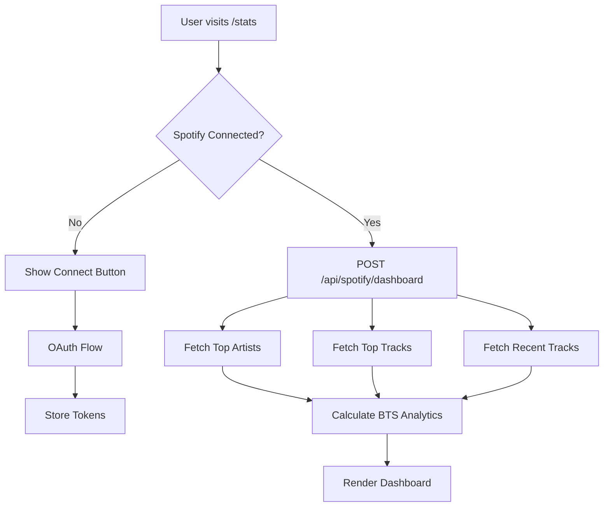
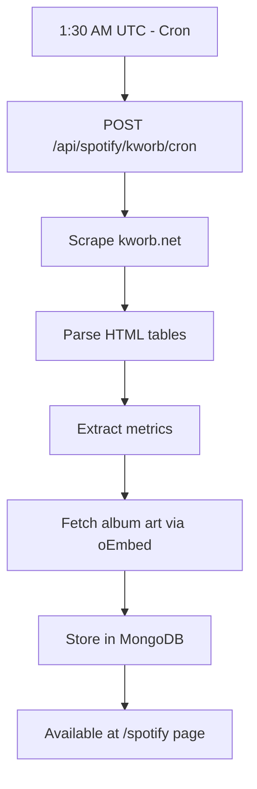
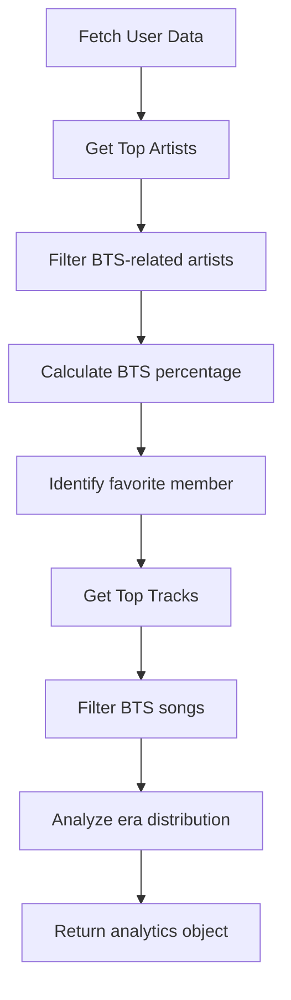

# Spotify Analytics

## What It Is

Comprehensive Spotify analytics and insights featuring:
- **Personal Dashboard** - Top artists, tracks, and listening habits
- **BTS-Specific Analytics** - BTS listening patterns and preferences
- **Recent Activity** - Recently played tracks with timestamps
- **Global Snapshots** - Daily streaming data for BTS songs and albums
- **Artist Rankings** - All-time most-streamed artists and monthly listeners

## How It Works

### Personal Analytics

**Data Sources:**
- Spotify Web API endpoints (user-top-read scope)
- Recently played tracks (user-read-recently-played scope)
- User profile data (user-read-private scope)

**Metrics Tracked:**
- Top artists (short, medium, long term)
- Top tracks (short, medium, long term)
- Recently played history
- Listening patterns by time of day
- BTS percentage of total listening

**Time Ranges:**
- **Short term**: Last 4 weeks
- **Medium term**: Last 6 months
- **Long term**: Several years of data

### BTS Analytics

**Specialized Insights:**
- BTS listening percentage
- Favorite BTS member (by play count)
- Most played BTS song
- BTS era distribution
- Solo work vs group work ratio
- Discovery timeline

### Global Streaming Snapshots

**Daily Data Collection:**
- Automated cron job at 1:30 AM UTC
- Scrapes kworb.net for latest data
- Stores in MongoDB for historical tracking

**Tracked Metrics:**
- Songs by artist (streams, daily gain, tracks count)
- Albums by artist (streams, daily gain, albums count)
- Global Daily Top 200 positions
- All-time most-streamed artists
- Monthly listeners count

**Page Layout (`/spotify`):**
1. Overview cards (total streams, daily momentum)
2. Songs by artist (expandable track lists)
3. Albums by artist (expandable album lists)
4. Global Daily Top 200 positions
5. Artist rankings (all-time + monthly listeners)

## Workflow

### Personal Dashboard Load Flow



### Global Snapshots Flow



### Dashboard Analytics Calculation



## API Reference

### POST /api/spotify/dashboard

Get comprehensive dashboard data for authenticated user.

**Authentication**: Required (Firebase + Spotify tokens)

**Request Body:**
```json
{
  "timeRange": "medium_term"
}
```

**Response:**
```json
{
  "ok": true,
  "profile": {
    "displayName": "User Name",
    "spotifyId": "spotify_user_id",
    "followers": 42,
    "profileImage": "https://i.scdn.co/image/..."
  },
  "topArtists": [
    {
      "id": "3Nrfpe0tUJi4K4DXYWgMUX",
      "name": "BTS",
      "images": [{ "url": "https://i.scdn.co/image/..." }],
      "genres": ["k-pop", "pop"],
      "popularity": 88
    }
  ],
  "topTracks": [
    {
      "id": "0JQ5IMCbBQpIFJ78bKZcVR",
      "name": "Dynamite",
      "artists": [{ "name": "BTS" }],
      "album": {
        "name": "BE",
        "images": [{ "url": "https://i.scdn.co/image/..." }]
      },
      "duration_ms": 199054
    }
  ],
  "recentTracks": [
    {
      "track": { "name": "Spring Day", "artists": [{ "name": "BTS" }] },
      "playedAt": "2025-01-29T10:30:00.000Z"
    }
  ],
  "btsAnalytics": {
    "totalBtsArtists": 3,
    "btsPercentage": 45,
    "favoriteMember": "Jungkook",
    "topBtsSong": "Dynamite",
    "eraDistribution": {
      "BE": 8,
      "Love Yourself": 12,
      "Map of the Soul": 6
    }
  }
}
```

### GET /api/spotify/top/artists

Get user's top artists.

**Authentication**: Required

**Query Parameters:**
- `time_range` (string): "short_term", "medium_term", or "long_term"
- `limit` (number): Max 50, default 20

### GET /api/spotify/top/tracks

Get user's top tracks.

**Authentication**: Required

**Query Parameters:**
- `time_range` (string): "short_term", "medium_term", or "long_term"
- `limit` (number): Max 50, default 20

### GET /api/spotify/recent

Get recently played tracks.

**Authentication**: Required

**Query Parameters:**
- `limit` (number): Max 50, default 20

### GET /api/spotify/audio-features

Get audio features for a track.

**Authentication**: Required

**Query Parameters:**
- `trackId` (string): Spotify track ID

**Response:**
```json
{
  "ok": true,
  "features": {
    "tempo": 114.0,
    "energy": 0.765,
    "danceability": 0.747,
    "valence": 0.737,
    "acousticness": 0.061,
    "instrumentalness": 0.0000234
  }
}
```

### GET /api/spotify/kworb/latest

Get latest global streaming snapshot.

**Query Parameters:**
- `cache` (boolean): Use cached data (default true)

**Response:**
```json
{
  "ok": true,
  "snapshot": {
    "dateKey": "2025-01-29",
    "songsByArtist": [
      {
        "artist": "BTS",
        "stats": {
          "totalStreams": 35420000000,
          "dailyStreams": 5200000,
          "trackCount": 234
        },
        "songs": [
          {
            "name": "Dynamite",
            "totalStreams": 2142268619,
            "dailyGain": 502410,
            "url": "https://kworb.net/spotify/track/...",
            "albumArt": "https://i.scdn.co/image/..."
          }
        ]
      }
    ],
    "globalRanks": {
      "allTimeArtists": [
        { "rank": 3, "artist": "BTS", "streams": 35420000000 }
      ],
      "monthlyListeners": [
        { "rank": 12, "artist": "BTS", "listeners": 42500000 }
      ]
    },
    "createdAt": "2025-01-29T01:30:00.000Z"
  }
}
```

### POST /api/spotify/kworb/cron

Trigger daily snapshot scraping (protected).

**Authentication**: Bearer token with CRON_SECRET

**Response:**
```json
{
  "ok": true,
  "message": "Snapshot created successfully",
  "dateKey": "2025-01-29",
  "artistCount": 8,
  "totalSongs": 234
}
```

## Configuration

### Environment Variables

```env
# Spotify API
SPOTIFY_CLIENT_ID=your-client-id
SPOTIFY_CLIENT_SECRET=your-client-secret
NEXT_PUBLIC_SPOTIFY_REDIRECT_URI=https://your-domain.com/api/spotify/callback
NEXT_PUBLIC_SPOTIFY_SCOPES=user-read-private user-read-email user-top-read user-read-recently-played

# Database
MONGODB_URI=your-mongodb-connection-string

# Cron (for snapshots)
CRON_SECRET=your-cron-secret
```

### Required Spotify Scopes

```
user-read-private       # User profile
user-read-email         # User email
user-top-read           # Top artists and tracks
user-read-recently-played # Recently played
```

## Database Schema

### Spotify Connection (in User model)

```typescript
{
  spotifyConnection: {
    connected: boolean,
    accessToken: string,        // Encrypted
    refreshToken: string,       // Encrypted
    expiresAt: Date,
    userId: string,
    scope: string
  }
}
```

### KworbSnapshot Model

```typescript
{
  dateKey: string,              // "YYYY-MM-DD"
  songsByArtist: [
    {
      artist: string,
      stats: {
        totalStreams: number,
        dailyStreams: number,
        trackCount: number
      },
      songs: [
        {
          name: string,
          totalStreams: number,
          dailyGain: number,
          url: string,
          albumArt: string
        }
      ]
    }
  ],
  albumsByArtist: [
    {
      artist: string,
      stats: {
        totalStreams: number,
        dailyStreams: number,
        albumCount: number
      },
      albums: [
        {
          name: string,
          totalStreams: number,
          dailyGain: number,
          url: string
        }
      ]
    }
  ],
  globalRanks: {
    dailyTop200: [
      { position: number, artist: string, song: string }
    ],
    allTimeArtists: [
      { rank: number, artist: string, streams: number }
    ],
    monthlyListeners: [
      { rank: number, artist: string, listeners: number }
    ]
  },
  createdAt: Date,
  updatedAt: Date
}
```

## Usage Examples

### Fetching Dashboard Data

```typescript
async function fetchDashboard(timeRange = 'medium_term') {
  const idToken = await user.getIdToken()
  
  const response = await fetch('/api/spotify/dashboard', {
    method: 'POST',
    headers: {
      'Content-Type': 'application/json',
      'Authorization': `Bearer ${idToken}`
    },
    body: JSON.stringify({ timeRange })
  })
  
  return response.json()
}
```

### Displaying Top Artists

```tsx
import { useState, useEffect } from 'react'

function TopArtists() {
  const [artists, setArtists] = useState([])
  
  useEffect(() => {
    async function fetchArtists() {
      const data = await fetchDashboard()
      setArtists(data.topArtists)
    }
    fetchArtists()
  }, [])
  
  return (
    <div>
      <h2>Your Top Artists</h2>
      {artists.map(artist => (
        <div key={artist.id}>
          
          <h3>{artist.name}</h3>
          <p>Popularity: {artist.popularity}</p>
        </div>
      ))}
    </div>
  )
}
```

### Calculating BTS Percentage

```typescript
function calculateBtsPercentage(topArtists) {
  const btsArtists = topArtists.filter(artist => 
    artist.name === 'BTS' || 
    artist.name.includes('Jung Kook') ||
    artist.name === 'V' ||
    artist.name === 'Jimin' ||
    // ... other members
  )
  
  return (btsArtists.length / topArtists.length) * 100
}
```

### Viewing Global Snapshots

```tsx
function SpotifySnapshotPage() {
  const [snapshot, setSnapshot] = useState(null)
  
  useEffect(() => {
    async function fetchSnapshot() {
      const response = await fetch('/api/spotify/kworb/latest')
      const data = await response.json()
      setSnapshot(data.snapshot)
    }
    fetchSnapshot()
  }, [])
  
  return (
    <div>
      <h1>Global BTS Streaming Data</h1>
      <p>Last updated: {snapshot?.dateKey}</p>
      
      {snapshot?.songsByArtist.map(artistData => (
        <div key={artistData.artist}>
          <h2>{artistData.artist}</h2>
          <p>Total Streams: {artistData.stats.totalStreams.toLocaleString()}</p>
          <p>Daily Gain: {artistData.stats.dailyStreams.toLocaleString()}</p>
          
          <h3>Top Songs</h3>
          {artistData.songs.slice(0, 10).map(song => (
            <div key={song.name}>
              
              <span>{song.name}</span>
              <span>{song.totalStreams.toLocaleString()}</span>
            </div>
          ))}
        </div>
      ))}
    </div>
  )
}
```

## Caching Strategy

### API Level Caching
- Dashboard data: 5 minute cache
- Top artists/tracks: 1 hour cache
- Recent tracks: No cache (always fresh)
- Global snapshots: 30 minute cache

### Database Caching
- Daily snapshots stored indefinitely
- Historical data for trend analysis
- Indexed by `dateKey` for fast queries

## Best Practices

### For Users
- ✅ Connect Spotify for full analytics
- ✅ Check dashboard regularly for insights
- ✅ Export data before disconnecting
- ✅ Use time range filters to see trends

### For Developers
- ✅ Refresh tokens before expiration
- ✅ Handle rate limiting gracefully
- ✅ Cache API responses appropriately
- ✅ Encrypt tokens at rest
- ✅ Implement proper error handling

## Troubleshooting

### Token Expired
- Implement automatic token refresh
- Use refresh token to get new access token
- Update stored tokens in database

### Rate Limiting
- Respect Spotify's rate limits
- Implement exponential backoff
- Cache responses to reduce API calls

### Missing Data
- Check if user has listening history
- Verify correct scopes are granted
- Ensure Spotify account is active

### Snapshot Not Updating
- Check cron job execution logs
- Verify MONGODB_URI is correct
- Manually trigger cron for testing

## Related Documentation

- [Authentication](./authentication.md) - Spotify OAuth setup
- [Trending Content](./trending-content.md) - Related snapshot data
- [Cron Jobs Setup](../setup/cron-jobs.md) - Snapshot automation
- [API Reference](../api/overview.md) - Complete API docs
