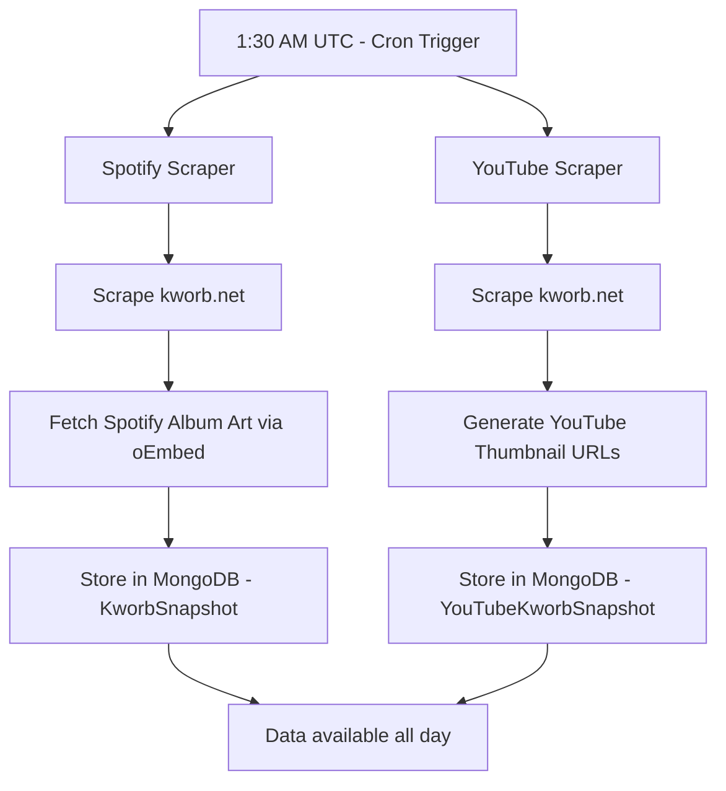
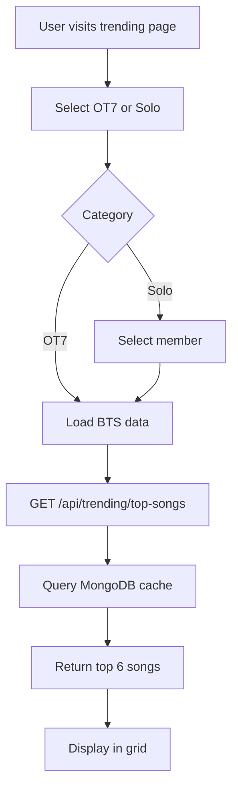

# Trending Content

## What It Is

Real-time trending BTS content from Spotify and YouTube, featuring:
- **Spotify Trending** - Top songs ranked by daily streams
- **YouTube Trending** - Top videos ranked by daily views
- **OT7 vs Solo Toggle** - Switch between group and individual member content
- **Member Selector** - Filter by any of the 7 BTS members
- **Automated Scraping** - Daily data updates via cron jobs
- **Cached Data** - Optimized performance with MongoDB caching

## How It Works

### Data Collection

**Automated Scraping:**
- Runs daily at 1:30 AM UTC via Vercel Cron Jobs
- Scrapes data from [kworb.net](https://kworb.net) (music statistics website)
- Fetches thumbnails (Spotify album art, YouTube video thumbnails)
- Stores everything in MongoDB for fast serving

**Data Sources:**
- **Spotify**: Global streaming data by artist
- **YouTube**: Global view counts by artist

### Ranking Algorithm

Songs/videos are ranked by **daily gain** (streams/views gained yesterday):
- Higher daily gain = higher rank
- Not based on total streams (avoids bias toward old releases)
- Refreshed daily to show current momentum

### Member Filtering

**Supported Artists:**
- **BTS (OT7)** - Group songs only
- **Jungkook** - Solo releases
- **V (Taehyung)** - Solo releases  
- **Jimin** - Solo releases
- **Jin** - Solo releases
- **Suga/Agust D** - Solo releases and mixtapes
- **RM** - Solo releases and mixtapes
- **J-Hope** - Solo releases

**Smart Keyword Matching:**
- Uses multiple language variants (Korean, English, Japanese)
- Handles special cases (RM vs "rm" substring, V as standalone word)
- Filters out collaborations properly
- Matches both stage names and real names

### Display Format

**3x2 Grid Layout:**
- #1 song takes 2x2 space (featured placement)
- Remaining 5 songs each take 1x1 space
- Hover effects with scale transitions
- Rank badges and daily stream counts
- External links to Spotify/YouTube

## Workflow

### Daily Scraping Flow



### User Request Flow



## API Reference

### GET /api/trending/top-songs

Get top trending songs for a platform and artist.

**Query Parameters:**
- `platform` (string, required): "spotify" or "youtube"
- `category` (string, required): "ot7" or "solo"
- `member` (string, optional): Member name (required if category is "solo")
  - Valid values: "Jungkook", "V", "Jimin", "Jin", "Suga", "RM", "J-Hope"

**Examples:**
```bash
# BTS group songs on Spotify
GET /api/trending/top-songs?platform=spotify&category=ot7

# Jungkook solo songs on Spotify
GET /api/trending/top-songs?platform=spotify&category=solo&member=Jungkook

# V solo videos on YouTube
GET /api/trending/top-songs?platform=youtube&category=solo&member=V
```

**Response:**
```json
{
  "ok": true,
  "platform": "spotify",
  "category": "solo",
  "artist": "Jungkook",
  "songs": [
    {
      "rank": 1,
      "name": "Seven (feat. Latto)",
      "artist": "Jung Kook",
      "totalStreams": 1500000000,
      "dailyGain": 850000,
      "url": "https://kworb.net/spotify/track/...",
      "albumArt": "https://i.scdn.co/image/..."
    },
    {
      "rank": 2,
      "name": "3D (feat. Jack Harlow)",
      "artist": "Jung Kook",
      "totalStreams": 900000000,
      "dailyGain": 620000,
      "url": "https://kworb.net/spotify/track/...",
      "albumArt": "https://i.scdn.co/image/..."
    }
  ],
  "dateKey": "2025-01-29",
  "lastUpdated": "2025-01-29T01:30:00.000Z"
}
```

### GET /api/spotify/kworb/latest

Get latest Spotify snapshot (debugging).

**Response:**
```json
{
  "ok": true,
  "snapshot": {
    "dateKey": "2025-01-29",
    "songsByArtist": [
      {
        "artist": "BTS",
        "songs": [...]
      },
      {
        "artist": "Jung Kook",
        "songs": [...]
      }
    ],
    "createdAt": "2025-01-29T01:30:00.000Z"
  }
}
```

### GET /api/youtube/kworb/latest

Get latest YouTube snapshot (debugging).

**Response:**
```json
{
  "ok": true,
  "snapshot": {
    "dateKey": "2025-01-29",
    "artistGroups": [
      {
        "artist": "BTS",
        "pageUrl": "https://kworb.net/youtube/artist/bts.html",
        "songs": [...]
      }
    ],
    "createdAt": "2025-01-29T01:35:00.000Z"
  }
}
```

### POST /api/spotify/kworb/cron

Trigger Spotify scraper manually (protected endpoint).

**Authentication**: Bearer token with CRON_SECRET

**Request:**
```bash
curl -X POST https://your-domain.com/api/spotify/kworb/cron \
  -H "Authorization: Bearer YOUR_CRON_SECRET"
```

**Response:**
```json
{
  "ok": true,
  "message": "Spotify scraping completed",
  "dateKey": "2025-01-29",
  "artistCount": 8,
  "totalSongs": 234
}
```

### POST /api/youtube/kworb/cron

Trigger YouTube scraper manually (protected endpoint).

**Authentication**: Bearer token with CRON_SECRET

**Request:**
```bash
curl -X POST https://your-domain.com/api/youtube/kworb/cron \
  -H "Authorization: Bearer YOUR_CRON_SECRET"
```

**Response:**
```json
{
  "ok": true,
  "message": "YouTube scraping completed",
  "dateKey": "2025-01-29",
  "artistCount": 8,
  "totalVideos": 187
}
```

## Configuration

### Environment Variables

```env
# Database (required)
MONGODB_URI=your-mongodb-connection-string

# Cron secret (for manual triggers)
CRON_SECRET=your-long-random-secret

# Optional: disable auth in development
DISABLE_CRON_AUTH=1
```

### Vercel Cron Configuration

Add to `vercel.json`:

```json
{
  "crons": [
    {
      "path": "/api/spotify/kworb/cron",
      "schedule": "30 1 * * *"
    },
    {
      "path": "/api/youtube/kworb/cron",
      "schedule": "35 1 * * *"
    }
  ]
}
```

**Schedule Format:** `minute hour day month dayOfWeek`
- `30 1 * * *` = 1:30 AM UTC daily
- `35 1 * * *` = 1:35 AM UTC daily (5 min after Spotify)

### Image Domains

Add to `next.config.js`:

```javascript
module.exports = {
  images: {
    domains: [
      'i.scdn.co',              // Spotify album art
      'image-cdn-ak.spotifycdn.com',
      'i.ytimg.com',            // YouTube thumbnails
      'img.youtube.com'
    ]
  }
}
```

## Database Schema

### KworbSnapshot (Spotify)

```typescript
{
  dateKey: string,              // "YYYY-MM-DD"
  songsByArtist: [
    {
      artist: string,           // "BTS", "Jung Kook", etc.
      songs: [
        {
          name: string,
          totalStreams: number,
          dailyGain: number,
          url: string,
          albumArt: string      // Spotify image URL
        }
      ]
    }
  ],
  createdAt: Date,
  updatedAt: Date
}
```

### YouTubeKworbSnapshot

```typescript
{
  dateKey: string,              // "YYYY-MM-DD"
  artistGroups: [
    {
      artist: string,           // "BTS", "V", etc.
      pageUrl: string,
      songs: [
        {
          rank: number,
          videoId: string,
          title: string,
          artist: string,
          views: number,
          yesterday: number,    // Daily gain
          published: string,
          thumbnail: string,    // YouTube thumbnail URL
          url: string
        }
      ]
    }
  ],
  createdAt: Date,
  updatedAt: Date
}
```

## Member Keywords

Keywords used for artist filtering:

| Member | Keywords |
|--------|----------|
| **BTS** | BTS, 방탄소년단, 防弾少年団 |
| **Jungkook** | Jung Kook, Jungkook, 정국 |
| **V** | V (standalone), Taehyung, 뷔, 태형 |
| **Jimin** | Jimin, 지민, 박지민 |
| **Jin** | Jin, Seokjin, 진, 석진 |
| **Suga** | Suga, Agust D, 슈가, 민윤기 |
| **RM** | RM, Rap Monster, 남준, 알엠 |
| **J-Hope** | J-Hope, Jhope, 제이홉, 호석, 정호석 |

**Special Cases:**
- **RM**: Careful matching to avoid "rm" substring false positives
- **V**: Must be standalone word to avoid matches in "mv", "vs", etc.
- **BTS**: Excludes solo member songs to show only group tracks
- **Suga**: Matches both "Suga" and "Agust D" personas

## Usage Examples

### Fetching Trending Data

```typescript
async function fetchTrending(platform: string, category: string, member?: string) {
  const params = new URLSearchParams({
    platform,
    category,
    ...(member && { member })
  })
  
  const response = await fetch(`/api/trending/top-songs?${params}`)
  const data = await response.json()
  
  return data.songs
}

// Usage
const btsSongs = await fetchTrending('spotify', 'ot7')
const jungkookSongs = await fetchTrending('spotify', 'solo', 'Jungkook')
const vVideos = await fetchTrending('youtube', 'solo', 'V')
```

### Using the Component

```tsx
import NewTrendingSection from '@/components/trending/NewTrendingSection'

export default function TrendingPage() {
  return (
    <div>
      <h1>Trending BTS Content</h1>
      <NewTrendingSection />
    </div>
  )
}
```

### Manual Scraping Trigger

```bash
# Development (no auth)
curl -X POST http://localhost:3000/api/spotify/kworb/cron

# Production (with auth)
curl -X POST https://armyverse.vercel.app/api/spotify/kworb/cron \
  -H "Authorization: Bearer your-cron-secret"
```

## Performance

### Scraping Time
- **Spotify**: 30-60 seconds (includes album art fetching)
- **YouTube**: 10-20 seconds (URL generation only)

### API Response Time
- **Cached data**: <100ms (MongoDB query)
- **First request**: 200-300ms (cache miss + build)

### Data Freshness
- **Updated**: Once per day at 1:30 AM UTC
- **Staleness**: Up to 24 hours (acceptable for trending data)

### Caching Strategy
- **API Level**: 30 min cache, 1 hour stale-while-revalidate
- **Database**: Daily snapshots with `dateKey` indexing
- **CDN**: Thumbnails served directly from Spotify/YouTube CDNs

## Troubleshooting

### No Data Showing

**Check if cron ran:**
```bash
curl https://your-domain.com/api/spotify/kworb/latest
curl https://your-domain.com/api/youtube/kworb/latest
```

Look for `dateKey` matching today's date.

**Manual trigger:**
```bash
curl -X POST https://your-domain.com/api/spotify/kworb/cron \
  -H "Authorization: Bearer YOUR_CRON_SECRET"
```

### Wrong Songs Appearing

1. Review keyword matching in scrapers
2. Check artist filtering logic
3. Verify source data on kworb.net
4. Test keyword matching with console logs

### Images Not Loading

1. Verify image domains in `next.config.js`
2. Check thumbnail URLs in MongoDB
3. Test URLs directly in browser
4. Check browser console for CORS errors
5. Clear browser cache

### Cron Not Running

1. Check Vercel dashboard → Cron Jobs
2. Verify `vercel.json` is committed
3. Check function logs for errors
4. Ensure environment variables are set

### Old Data Showing

1. Check `dateKey` in database
2. Trigger cron manually
3. Wait for next automatic run (1:30 AM UTC)
4. Clear API cache

## Monitoring

### Check Cron Execution

**Vercel Dashboard:**
1. Go to your project
2. Click Settings → Cron Jobs
3. View execution history and logs

**Debug Page:**
Visit `/test-trending` to see:
- Last scrape date
- Number of songs per artist
- Manual trigger buttons

### Success Indicators

✅ `dateKey` matches today's date  
✅ Songs have thumbnails  
✅ Daily gain values are recent  
✅ No error logs in Vercel functions  
✅ API response time <100ms  

## Cost Breakdown

| Item | Frequency | Cost |
|------|-----------|------|
| Vercel Cron Jobs | 2 per day | Free (Hobby plan) |
| MongoDB Reads | ~1000 per day | Free (Atlas M0) |
| MongoDB Writes | 2 per day | Free |
| Spotify oEmbed API | ~300 per day | Free (no limit) |
| YouTube Thumbnails | 0 (URL only) | Free |
| **Total** | | **$0/month** |

## Best Practices

### For Users
- ✅ Check trending daily for new releases
- ✅ Use member filter to find solo content
- ✅ Click through to stream on platform
- ✅ Share trending content with ARMY friends

### For Developers
- ✅ Don't modify cron schedule unnecessarily
- ✅ Cache thumbnails, don't fetch on every request
- ✅ Monitor MongoDB storage for old snapshots
- ✅ Set up alerts if crons fail
- ✅ Use `dateKey` index for fast queries
- ✅ Implement graceful degradation if scraping fails

## Related Documentation

- [Cron Jobs Setup](../setup/cron-jobs.md) - Detailed cron configuration
- [API Reference](../api/trending.md) - Complete API documentation
- [Database Schema](../architecture/database.md) - Data models
