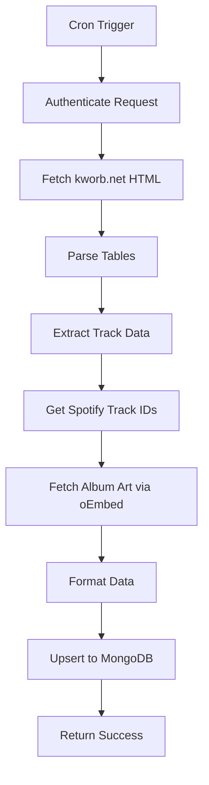
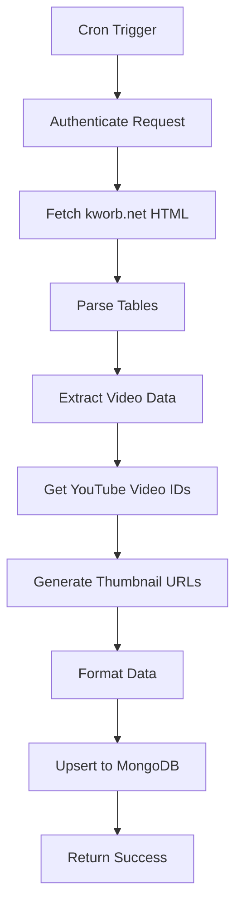

# Cron Jobs Setup

Automated scraping of trending BTS content from Spotify and YouTube, plus daily YouTube analytics.

## Overview

Three cron jobs run daily to keep data fresh:

| Job | Schedule | Time (UTC) | Frequency | Purpose |
|-----|----------|-----------|-----------|---------|
| Spotify | `30 1 * * *` | 1:30 AM | Daily | Scrape Spotify streaming data + album art |
| YouTube | `35 1 * * *` | 1:35 AM | Daily | Scrape YouTube view data + thumbnails |
| YouTube Detail Cache | `0 0 * * *` | Midnight | Daily | Refresh YouTube video detail cache |

## How It Works

### Daily Scraping Cycle

```
1:30 AM UTC
    ↓
Spotify Scraper Runs
    ↓
Fetches data from kworb.net
    ↓
Gets album art from Spotify oEmbed
    ↓
Saves to MongoDB (KworbSnapshot)
    ↓
1:35 AM UTC
    ↓
YouTube Scraper Runs
    ↓
Fetches data from kworb.net
    ↓
Generates thumbnail URLs
    ↓
Saves to MongoDB (YouTubeKworbSnapshot)
    ↓
Data available all day
    ↓
Users see cached data (fast!)
```

### Why This Approach?

✅ **Fresh data daily** - Rankings updated every morning  
✅ **No API limits** - Thumbnails fetched once, not per request  
✅ **Fast performance** - Data served from MongoDB cache  
✅ **Cost efficient** - Only 2 operations per day  
✅ **Reliable** - No rate limiting issues  

## Configuration

### vercel.json

Already configured in the repository:

```json
{
  "crons": [
    {
      "path": "/api/spotify/kworb/cron",
      "schedule": "30 1 * * *"
    },
    {
      "path": "/api/youtube/kworb/cron",
      "schedule": "35 1 * * *"
    }
  ]
}
```

**Note:** The `/youtube` page analytics are refreshed via the YouTube cron job at 1:35 AM UTC. The page at `/youtube` displays:
- BTS (OT7) videos: ~151 videos
- Solo member videos: Jungkook (15), V (2), Suga (11), RM (14), Jimin (10), Jin (9), J-Hope (16)
- Total views, daily average, and video rankings
- Detailed video statistics (cached for 24 hours)

**Cron Schedule Format:** `minute hour day month dayOfWeek`

Examples:
- `30 1 * * *` = Every day at 1:30 AM UTC
- `0 */6 * * *` = Every 6 hours
- `0 0 * * 0` = Every Sunday at midnight
- `*/15 * * * *` = Every 15 minutes

### Environment Variables

```env
# Required
MONGODB_URI=your-mongodb-connection-string
CRON_SECRET=your-long-random-secret

# Optional (dev only)
DISABLE_CRON_AUTH=1
```

Generate CRON_SECRET:
```bash
openssl rand -hex 32
```

## Cron Endpoints

### POST /api/spotify/kworb/cron

Scrapes Spotify trending data.

**Authentication:** Bearer token with CRON_SECRET

**Process:**
1. Scrape kworb.net for streaming data
2. Parse HTML tables
3. Extract track IDs
4. Fetch album art via Spotify oEmbed API
5. Save to `KworbSnapshot` collection with dateKey

**What It Collects:**
- Song name, artist, total streams, daily gain
- Album artwork URLs
- Data for: BTS (OT7), Jungkook, V, Jimin, Jin, Suga, RM, J-Hope

**Response:**
```json
{
  "ok": true,
  "message": "Spotify scraping completed successfully",
  "dateKey": "2025-01-29",
  "artistCount": 8,
  "totalSongs": 234,
  "executionTime": "42.3s"
}
```

### POST /api/youtube/kworb/cron

Scrapes YouTube trending data.

**Authentication:** Bearer token with CRON_SECRET

**Process:**
1. Scrape kworb.net for view data
2. Parse HTML tables
3. Extract video IDs
4. Generate YouTube thumbnail URLs
5. Save to `YouTubeKworbSnapshot` collection with dateKey

**What It Collects:**
- Video title, artist, total views, daily gain
- YouTube video IDs and thumbnail URLs
- Data for same 8 artists as Spotify

**Response:**
```json
{
  "ok": true,
  "message": "YouTube scraping completed successfully",
  "dateKey": "2025-01-29",
  "artistCount": 8,
  "totalVideos": 187,
  "executionTime": "18.7s"
}
```

## Manual Triggering

### Development (localhost)

No authentication required if `DISABLE_CRON_AUTH=1`:

```bash
# Spotify scraper
curl -X POST http://localhost:3000/api/spotify/kworb/cron

# YouTube scraper
curl -X POST http://localhost:3000/api/youtube/kworb/cron
```

### Production (Vercel)

Requires authentication:

```bash
# Spotify scraper
curl -X POST https://your-domain.vercel.app/api/spotify/kworb/cron \
  -H "Authorization: Bearer YOUR_CRON_SECRET"

# YouTube scraper
curl -X POST https://your-domain.vercel.app/api/youtube/kworb/cron \
  -H "Authorization: Bearer YOUR_CRON_SECRET"
```

### Debug Page

Visit `/test-trending` in browser:
- Shows last scrape date
- Shows number of songs/videos per artist
- Manual trigger buttons (requires auth in production)

## Vercel Cron Dashboard

### View Cron Jobs

1. Vercel Dashboard → Your Project
2. Settings → Cron Jobs
3. View all scheduled crons

### Execution History

See past runs:
- Timestamp of execution
- Status (success/failure)
- Duration
- Logs link

### Monitor Health

Check for:
- ✅ Regular executions (daily at scheduled times)
- ✅ Success status
- ✅ Reasonable execution time (<60s)
- ⚠️ Any failures or errors

## Data Flow

### Spotify Scraper Flow



### YouTube Scraper Flow



## Database Storage

### KworbSnapshot Collection

```typescript
{
  dateKey: "2025-01-29",        // Unique per day
  songsByArtist: [
    {
      artist: "BTS",
      songs: [
        {
          name: "Dynamite",
          totalStreams: 2142268619,
          dailyGain: 502410,
          url: "https://kworb.net/spotify/track/...",
          albumArt: "https://i.scdn.co/image/..."
        }
      ]
    }
  ],
  createdAt: Date,
  updatedAt: Date
}
```

**Index:** `{ dateKey: 1 }` (unique)

### YouTubeKworbSnapshot Collection

```typescript
{
  dateKey: "2025-01-29",
  artistGroups: [
    {
      artist: "BTS",
      pageUrl: "https://kworb.net/youtube/artist/bts.html",
      songs: [
        {
          rank: 1,
          videoId: "gdZLi9oWNZg",
          title: "Dynamite Official MV",
          artist: "BTS",
          views: 2006334400,
          yesterday: 553684,
          published: "2020-08-21",
          thumbnail: "https://i.ytimg.com/vi/gdZLi9oWNZg/maxresdefault.jpg",
          url: "https://www.youtube.com/watch?v=gdZLi9oWNZg"
        }
      ]
    }
  ],
  createdAt: Date,
  updatedAt: Date
}
```

**Index:** `{ dateKey: 1 }` (unique)

## Monitoring & Alerts

### Check Last Run

```bash
# Spotify
curl https://your-domain.vercel.app/api/spotify/kworb/latest

# YouTube
curl https://your-domain.vercel.app/api/youtube/kworb/latest
```

Look for `dateKey` - should be today's date.

### Set Up Alerts

**Using Vercel Integrations:**
1. Add Slack or Discord integration
2. Configure to alert on cron failures
3. Get notified if jobs don't run

**Using External Monitoring:**
- [UptimeRobot](https://uptimerobot.com/) - Free monitoring
- [Cronitor](https://cronitor.io/) - Cron-specific monitoring
- [Better Uptime](https://betteruptime.com/) - Alerts and on-call

## Troubleshooting

### Cron Not Running

**Check Vercel dashboard:**
1. Settings → Cron Jobs
2. View execution history
3. Look for errors

**Common issues:**
- `vercel.json` not committed to Git
- Incorrect cron syntax
- Environment variables missing
- Function timeout (>10s on Hobby plan)

**Solution:**
```bash
# Verify vercel.json is in repo
git ls-files | grep vercel.json

# Manually trigger to test
curl -X POST https://your-domain.vercel.app/api/spotify/kworb/cron \
  -H "Authorization: Bearer YOUR_CRON_SECRET"
```

### Data Not Updating

**Check dateKey in database:**
```bash
# Should show today's date
curl https://your-domain.vercel.app/api/spotify/kworb/latest
```

**If dateKey is old:**
1. Check cron execution logs
2. Look for scraping errors
3. Manually trigger scraper
4. Verify MongoDB connection

**Common issues:**
- kworb.net structure changed (rare)
- MongoDB connection timeout
- Cloudflare blocking requests (use proper user-agent)

### Thumbnails Not Loading

**Spotify album art:**
- Verify `i.scdn.co` in `next.config.js` image domains
- Check oEmbed API responses
- Test URLs directly in browser

**YouTube thumbnails:**
- Verify `i.ytimg.com` in `next.config.js` image domains
- Check video IDs are correct
- Test thumbnail URLs directly

### Authentication Errors

**401 Unauthorized:**
- Verify `CRON_SECRET` in environment variables
- Check Authorization header format
- Ensure secret matches exactly

**Disable auth for testing (dev only):**
```env
DISABLE_CRON_AUTH=1
```

## Performance

### Execution Time

**Target times:**
- Spotify: 30-60 seconds (album art fetching takes time)
- YouTube: 10-20 seconds (no external API calls)

**Optimization:**
- Parallel requests for album art
- Batch database writes
- Connection pooling

**Vercel Limits:**
- Hobby plan: 10s max per function
- Pro plan: 60s max per function
- If exceeding, upgrade to Pro or optimize code

### Data Freshness

- **Update frequency**: Once per day (1:30 AM UTC)
- **Staleness**: Up to 24 hours
- **Acceptable**: Yes, trending data doesn't need real-time updates

### Cost

| Item | Frequency | Cost |
|------|-----------|------|
| Vercel Cron | 2 per day | Free (Hobby plan) |
| MongoDB Writes | 2 per day | Free (M0 tier) |
| Spotify oEmbed | ~300 per day | Free (no limit) |
| YouTube Thumbnails | 0 (URL only) | Free |
| **Total** | | **$0/month** |

## Best Practices

### Do's
✅ Run once per day (sufficient for trending data)  
✅ Store thumbnails in database  
✅ Use unique `dateKey` for idempotency  
✅ Implement error handling  
✅ Log execution details  
✅ Monitor for failures  

### Don'ts
❌ Don't run too frequently (waste of resources)  
❌ Don't fetch thumbnails on every user request  
❌ Don't skip authentication in production  
❌ Don't ignore errors silently  
❌ Don't exceed function timeout  

## Advanced Configuration

### Multiple Times Per Day

If you need more frequent updates:

```json
{
  "crons": [
    { "path": "/api/spotify/kworb/cron", "schedule": "30 1 * * *" },
    { "path": "/api/spotify/kworb/cron", "schedule": "30 13 * * *" }
  ]
}
```

This runs at 1:30 AM and 1:30 PM UTC.

### Webhook Notifications

Add webhook on completion:

```typescript
// In cron route after successful scrape
await fetch('https://your-webhook-url.com', {
  method: 'POST',
  body: JSON.stringify({
    status: 'success',
    dateKey: dateKey,
    timestamp: new Date().toISOString()
  })
})
```

### Cleanup Old Data

Add cleanup cron to remove old snapshots:

```json
{
  "crons": [
    {
      "path": "/api/cleanup/old-snapshots",
      "schedule": "0 2 * * 0"
    }
  ]
}
```

Runs weekly on Sunday at 2:00 AM UTC.

## Related Documentation

- [Trending Content](../features/trending-content.md) - How trending system works
- [Spotify Analytics](../features/spotify-analytics.md) - Related analytics features
- [YouTube Analytics](../features/youtube-analytics.md) - YouTube video statistics and `/youtube` page
- [Environment Variables](./environment-variables.md) - Required variables
- [Deployment Guide](./deployment.md) - Setting up Vercel
